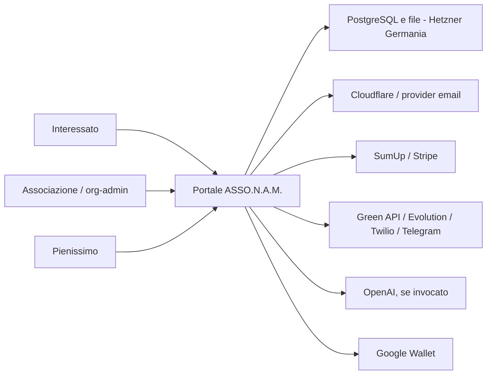

# Mappa dei dati e dei ruoli

## Flusso sintetico

## Inventario dei trattamenti

| Trattamento | Dati principali | Finalità | Ruolo prevalente | Base di lavoro | Conservazione |
|---|---|---|---|---|---|
| Affiliazione associazioni | Anagrafica ente/referenti, documenti, pagamento | Gestire affiliazione e servizi centrali | ASSO.N.A.M. titolare | Misure/rapporto, obblighi | Rapporto + termini contabili/difesa |
| Iscrizione locale | Anagrafica, contatti, C.F., nascita, dichiarazioni, eventuale documento | Ammissione e gestione socio locale | Associazione titolare; ASSO.N.A.M. responsabile | Misure richieste/rapporto associativo | Vedi policy |
| Libro soci e tessera locale | Identificativi, numero, stato, validità | Registro e prova appartenenza | Associazione titolare; ASSO.N.A.M. responsabile | Rapporto/obblighi | Operativo + 12 mesi; storico minimo 10 anni |
| Tessera/registro nazionale, se previsto | Identificativi e stato tessera | Programma centrale | Da statuto: ASSO.N.A.M. titolare o contitolarità | Rapporto/legittimo interesse da validare | 10 anni per evidenza minima proposta |
| Verifica pubblica tessera | Token, numero, iniziali e dati pubblicati | Verificare autenticità/stato | Titolare del programma tessera | Legittimo interesse/rapporto | Durata tessera + difesa minima |
| Pagamento quota | Email, importo, stato, riferimento provider | Incasso e riconciliazione | Titolare del rapporto; provider destinatario/responsabile secondo contratto | Rapporto e obblighi contabili | Payload 90 giorni; record minimo 10 anni |
| Account e sicurezza | Email, hash password, sessioni, IP/log minimizzati | Accesso, antifrode e sicurezza | ASSO.N.A.M. titolare per sicurezza centrale; titolare locale per utenze proprie | Legittimo interesse | Token scaduti +30 giorni; log 30/90 giorni |
| Comunicazioni di servizio | Contatto, evento, corpo, esito | Iscrizione, tessera, pagamento, rinnovo, booking | Titolare della finalità; ASSO.N.A.M. responsabile tecnico dove applicabile | Rapporto/obbligo | Delivery 24 mesi; contenuto secondo finalità |
| Campagne locali | Email, consenso, campagna e delivery | Eventi/iniziative dell'associazione | Associazione titolare; ASSO.N.A.M. responsabile | Consenso specifico | Uso fino a revoca/inattività; prova 5 anni |
| Moduli e prenotazioni | Dati inseriti, evento, note, stato | Gestire richieste/eventi locali | Associazione titolare; ASSO.N.A.M. responsabile | Richiesta/rapporto/consenso se necessario | Submission 12 mesi; booking 24 mesi |
| WhatsApp/chat | Numeri, messaggi, allegati/metadati | Assistenza e workflow richiesti | Titolare della conversazione; gateway destinatari | Richiesta/rapporto | Chat 180 giorni; webhook grezzo 7 giorni |
| Assistenza AI | Testo libero non riconosciuto e metadati minimizzati | Supportare risposta automatizzata | Titolare della conversazione; OpenAI fornitore | Legittimo interesse/rapporto da validare | Minimizzare; massimo coerente con chat |
| Import Pienissimo | Dati socio, associazione, tessera | Registrazione/emissione | Da contratto; rischio chiave condivisa accettato | Rapporto/istruzioni | Come socio/tessera |
| Audit e cancellazione | ID tecnici, azione, esito | Accountability, sicurezza e cancellazione affidabile | ASSO.N.A.M. titolare per sicurezza | Legittimo interesse/obbligo | Audit admin 24 mesi; code terminali minimizzate |

## Confini e regole

- Un org-admin può vedere e modificare solo dati della propria organizzazione.
- I campi liberi non devono raccogliere salute, dati giudiziari, biometria o altre categorie particolari senza nuova base, minimizzazione e screening DPIA.
- Il consenso marketing implementato riguarda solo promozioni dell'associazione di iscrizione via email; non autorizza marketing ASSO.N.A.M., partner, WhatsApp o SMS.
- La pagina pubblica di verifica deve mostrare soltanto i dati deliberatamente approvati per quella finalità e non diventare un elenco ricercabile.
- Ogni nuovo provider o nuova regione deve aggiornare ROPA, informativa, registro fornitori e valutazione trasferimenti prima dell'uso con dati reali.
